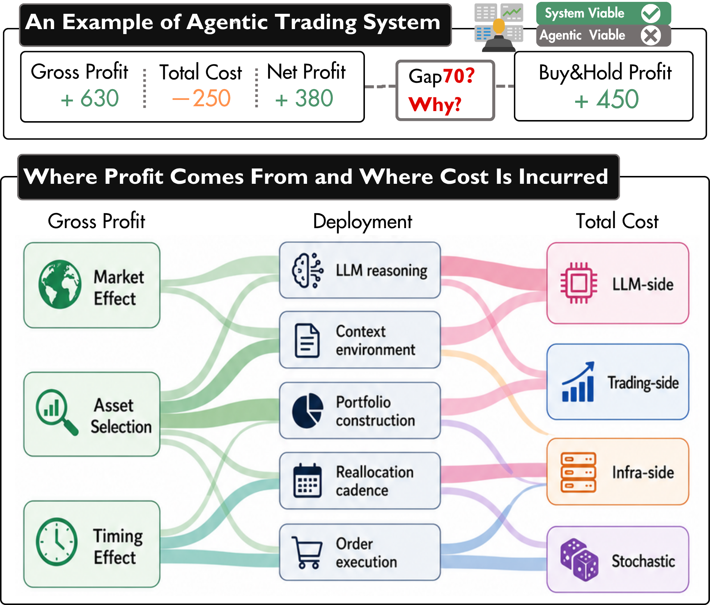
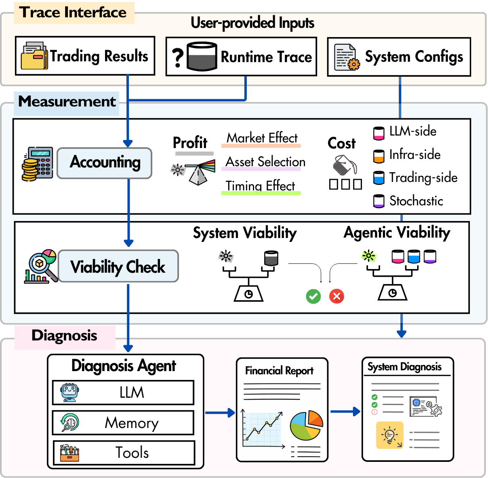

# TradeLens Toolkit

TradeLens is a trace-grounded toolkit for **measuring** and **diagnosing** the *profit vs. cost* of agentic trading systems.

Large language model (LLM) agents are increasingly used in trading systems, where reasoning, tool use, and repeated portfolio decisions introduce non-negligible deployment costs. A system can look profitable on returns yet still fail to create useful value once costs are accounted for, and diagnosing the root cause is hard because profit and cost arise from intertwined mechanisms.


<p align="center">
  
</p>


We argue that **agentic viability** should be a central evaluation criterion: dynamic LLM-mediated decisions should generate enough incremental profit to justify the costs they induce. TradeLens reconstructs trading trajectories from records and traces, attributes profit and cost to interpretable evidence, and diagnoses whether, where, and why an agent succeeds or fails to pay for its own intelligence.


## What It Does

TradeLens supports:

1. **Measurement** — profit and cost attribution for multi-factor agentic trading deployments.
2. **Diagnosis** — trading performance analysis and system-level diagnosis with evidence-grounded revision suggestions.

<p align="center">
  
</p>


## Introduce 

### Workflow

The toolkit loads experiment records and static config from `data/`, computes trading costs (commission, token usage, infra, monthly data subscription, and a per-day uncertain add-on), reconstructs portfolio value, and decomposes profit into market / selection / timing effects (full-cash and invested-only benchmarks).

It writes reports under `result/` and, when configured, runs LLM diagnosis on top of the financial report.


### Repository Structure

```
TradeLens/
├── data/              # Input: records, static configs, price JSONL
├── toolkit/           # Toolkit: measurement + diagnosis
├── result/            # Output: reports and charts 
├── main.py            # Entry: python main.py → toolkit.main
├── config_llm.json    # Per-model token pricing
├── config.json        # Paths into data diagnosis settings
├── env.example        # API keys for LLM diagnosis
```

| Path | Role |
|------|------|
| **`data/`** | **Input.** Experiment `experiment_records_*.jsonl`, `static-*.jsonl`, `price-data.jsonl` , optional `market-base.jsonl`. |
| **`toolkit/`** | **Toolkit.** Measurement (`cost/`, `profit/`) and diagnosis (`report/`). Run via `python main.py`. |
| **`result/`** | **Output.** One folder per run: `result/<model>-<cash>-<frequency>/`. Gitignored. |


### Inside `toolkit/`

| Module | Responsibility |
|--------|----------------|
| `toolkit/main.py` | CLI and end-to-end pipeline |
| `toolkit/cost/` | Commission, token/infra/monthly/uncertain costs |
| `toolkit/profit/` | Records, portfolio valuation, profit breakdown |
| `toolkit/report/` | Financial report, plots, LLM agent, HTML render |
| `toolkit/config.py` | Load `config.json`, static config, LLM pricing |


## Usage

## Quick Start

1. `python -m venv .venv` && `source .venv/bin/activate`
2. `pip install -r requirements.txt`
3. Edit  `config.json`, and point `records_path` / `static_path` to your files under `data/`
4. Edit **`config_llm.json`** so each model in your records has a pricing row (otherwise token cost will be **0**)
5. Copy `.env.example' to `.env' and set your URL and API key
6. Run:
   - `python main.py`
   - (optional overrides) `python main.py --records data/...jsonl --static data/...jsonl --out result/my-run`

### CLI

```text
python main.py --help
python main.py [--config CONFIG] [--records RECORDS] [--static STATIC] [--out OUT] [--benchmark SYMBOL]
```


### Inputs (`data/` + configuration)

#### configuration

| Field | Description |
|-------|-------------|
| `records_path` | Experiment records JSONL, e.g. `data/experiment_records_*.jsonl` |
| `static_path` | Static config JSON/JSONL, e.g. `data/static-*.jsonl` |
| `prices_path` | Daily prices JSONL, e.g. `data/price-data.jsonl` |
| `market_base_path` | Optional benchmark price JSONL, e.g. `data/market-base.jsonl` |
| `agent_model` | LLM model for diagnosis (optional) |
| `benchmark_symbol` | Benchmark symbol (default `SPY`) |
| `llm_call_success_rate` | Scales token costs (default `1.0`) |

#### Record / static / price conventions (high level)

- **Records (JSONL)**: each line is a trading-day record; key fields include `date`, `llm_usage`, `trades` (with `decision_type`, `ticker`, `quantity`, and prices).
- **Static (JSON or JSONL)**: deployment metadata such as `initial_cash`, `decision_frequency`, `data_subscription_monthly`, `start_time`, `end_time`, and `llm_model`.
- **Prices (JSONL)**: Alpha Vantage–style daily buy prices per symbol (see `data/price-data*.jsonl`).

### Outputs (`result/`)

Default output directory:

- `result/<llm_model>-<initial_cash>-<frequency>/` (or pass `--out`)

Common files:

- `*-action.txt`: daily actions and cost ledger
- `*-financial-report.md` and `*-financial-report.html`: financial report + embedded charts
- `*-llm-analysis.md` and `*-llm-analysis.html`: LLM diagnosis (when enabled)
- `charts/*.png`: charts referenced by the markdown reports


## Integrate with your agentic trading system

TradeLens is an **after-the-fact** analysis toolkit: you run your own agentic trading system, export its records/traces, then run TradeLens to attribute profit & cost and generate reports.

### Step 1) Export `experiment_records.jsonl`

Write one JSON object per line (JSONL). Each line corresponds to one **decision day** (recommended date format: `YYYY-MM-DD`).

Minimal example:

```json
{"date":"2026-01-02","model":"gpt-5.2","llm_usage":{"model":"gpt-5.2","input_tokens":1200,"output_tokens":450,"cached_tokens":0,"latency_ms":820},"trades":[{"decision_type":"BUY","ticker":"AAPL","quantity":10,"analysis_price":188.12,"execution_price":188.40,"timestamp":{"analysis_time":"2026-01-02T14:30:00Z","decision_time":"2026-01-02T14:30:01Z"}}]}
```

Notes:

- `llm_usage.model` must match a key in `config_llm.json` (otherwise token cost cannot be priced).
- If you provide both `analysis_price` and `execution_price`, TradeLens can estimate slippage/opportunity cost.
- If you provide `timestamp.analysis_time` and `timestamp.decision_time`, TradeLens can compute analysis→decision latency.

### Step 2) Record your setting to `static.json`

TradeLens expects a JSON file with a required `structure` field. Fields in `structure` are merged into the top-level config.

Minimal example:

```json
{
  "structure": {
    "llm_model": "gpt-5.2",
    "initial_cash": 100000,
    "decision_frequency": "daily",
    "data_subscription_monthly": 100.0,
    "start_time": "2026-01-01",
    "end_time": "2026-01-30"
  }
}
```

### Step 3) Provide prices data (`price-data.jsonl`)

Provide trading asset prices for your predefined time window from the same data source as your system.

```json
{"Meta Data":{"2. Symbol":"AAPL"},"Time Series (Daily)":{"2026-01-02":{"1. buy price":"188.12"},"2026-01-03":{"1. buy price":"190.05"}}}
```

### Step 4) Run TradeLens on your exported artifacts

```bash
python main.py --records /path/to/experiment_records.jsonl --static /path/to/static.json --out result/my-run
```

If your system makes multiple intraday decisions, pre-aggregate records to hourly entries.

## Troubleshooting

- **`records_path not found` / `static_path not found`**: ensure `config.json` points to existing files under `data/`, or pass `--records/--static` explicitly.
- **Profit breakdown warning about BUY/SELL**: if your records contain only `HOLD` days (no executed trades), profit breakdown charts/attribution may be skipped.
- **Plotting warnings (`matplotlib` / `numpy`)**: reinstall dependencies in a fresh venv (e.g. recreate `.venv`, then `pip install -r requirements.txt`).
