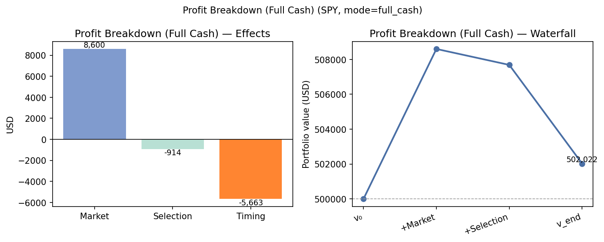
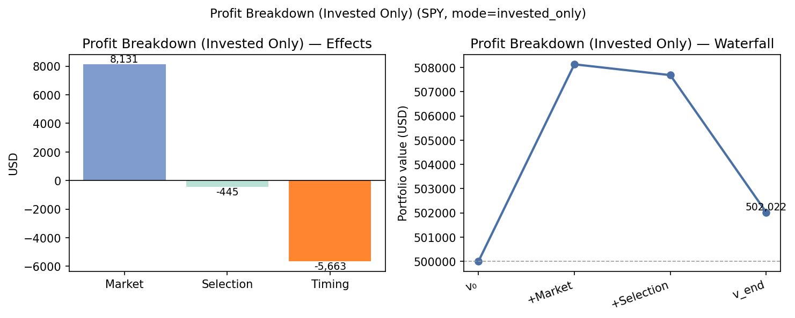
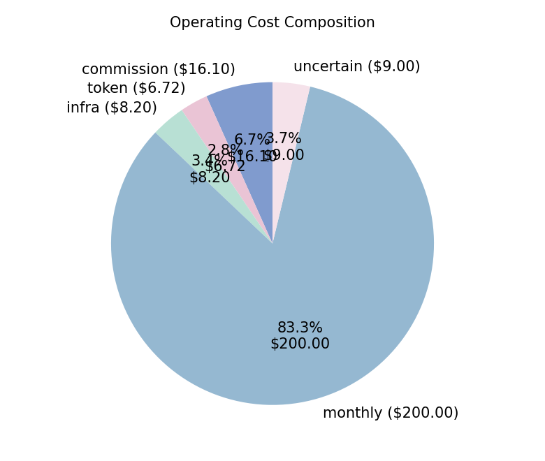
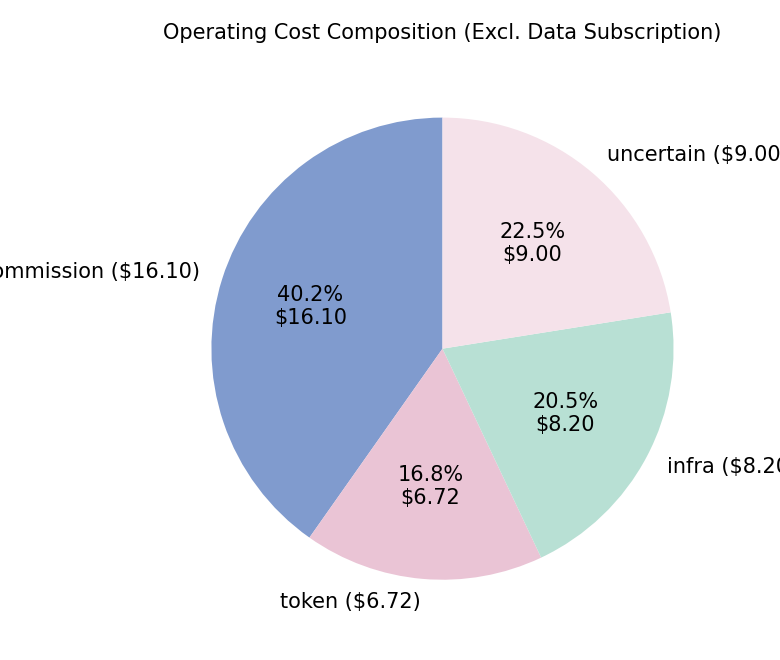
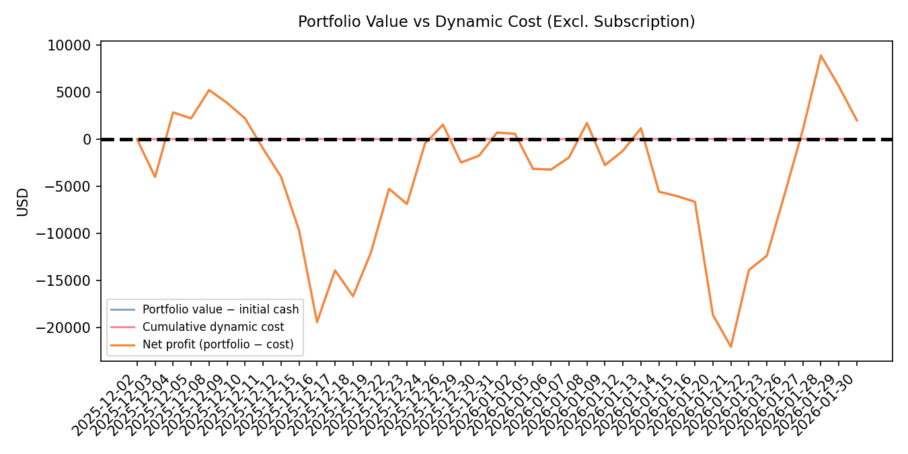

# Financial Report

## 1. Trading Configuration

Trading Period:
2025-12-01 - 2026-01-30

Trading Model / Strategy:
gpt-5.2

Assets:
AMZN, AVGO, GOOG, META, MSFT, NVDA

## 2. Asset & Portfolio State

Initial Cash:
500000.00

Current Cash:
10095.87

Positions:
- AMZN: 290
- AVGO: 175
- GOOG: 220
- META: 120
- MSFT: 240
- NVDA: 512

Total Position Value:
491926.62

Total Portfolio Value:
502022.49

## 3. Performance

Return / Profit:
2022.49

### Figure 1. Profit Attribution — Full Cash Benchmark

### Figure 2. Profit Attribution — Invested Cash Only

## 3.1 Profit Breakdown (market / selection / timing)

Benchmark Symbol: SPY
Benchmark Available: True
Benchmark Return: 1.72%

v0 (Initial Cash):
500000.00

v_market (Benchmark Final Value):
508599.53

v_static (Initial Holdings Buy&Hold Final Value):
507685.30

v_end (Strategy Final Value):
502022.49

Market Effect:
8599.53

Asset Selection Effect:
-914.23

Timing Effect:
-5662.80

Total Profit:
2022.49

Initial Holdings (first build day, post-trade):
AMZN:300, AVGO:140, GOOG:220, META:140, MSFT:200, NVDA:500

## 3.2 Financial Statement (Profit & Loss Style)

Two attribution views: **full initial cash** tracks the whole portfolio against the benchmark; **invested-only** removes idle cash after the first build day when applying market moves.

### Table A — Full Cash / Market Benchmark

Benchmark: **SPY** | Mode: `full_cash` | Benchmark return: 1.72%

| Line item | Amount (USD) |
| --- | ---: |
| Initial capital (v₀) | 500,000.00 |
| Benchmark portfolio at end (v_market) | 508,599.53 |
| Buy & hold portfolio at end (v_static) | 507,685.30 |
| Strategy portfolio at end (v_end) | 502,022.49 |
| | |
| **Profit attribution** | |
| Market effect | 8,599.53 |
| Asset selection effect | -914.23 |
| Timing effect | -5,662.80 |
| **Total profit (gross)** | **2,022.49** |
| | |
| Invested cash (excl. idle cash after day 1) | 472,733.50 |
| Cash after first build day | 27,266.50 |

### Table B — Invested Cash Only (Proportional to Deployed Capital)

Benchmark: **SPY** | Mode: `invested_only` | Benchmark return: 1.72%

| Line item | Amount (USD) |
| --- | ---: |
| Initial capital (v₀) | 500,000.00 |
| Benchmark portfolio at end (v_market) | 508,130.57 |
| Buy & hold portfolio at end (v_static) | 507,685.30 |
| Strategy portfolio at end (v_end) | 502,022.49 |
| | |
| **Profit attribution** | |
| Market effect | 8,130.57 |
| Asset selection effect | -445.27 |
| Timing effect | -5,662.80 |
| **Total profit (gross)** | **2,022.49** |
| | |
| Invested cash (excl. idle cash after day 1) | 472,733.50 |
| Cash after first build day | 27,266.50 |

### Consolidated Net Outcome (two views)

| Line item | Amount (USD) |
| --- | ---: |
| **Portfolio level** | |
| Gross profit (v_end − v₀) | 2,022.49 |
| Static cost (data subscription) | -200.00 |
| Dynamic cost (commission + token + infra + uncertain) | -40.01 |
| Total operating cost | -240.01 |
| **Net economic outcome (gross − total cost)** | **1,782.48** |
| | |
| **Execution / timing layer** | |
| Timing effect (vs initial buy&hold) | -5,662.80 |
| Dynamic cost (same as above) | -40.01 |
| **Net timing outcome (timing − dynamic cost)** | **-5,702.82** |
## 3.3 Risk & Trading Metrics

Portfolio-level risk and trading statistics derived from daily portfolio replay.

_Note: Sample length is sufficient for basic risk statistics._

### Return & Risk

| Metric | Value |
| --- | ---: |
| Total return | 0.40% |
| Annualized return | 2.58% |
| Sharpe ratio (rf=4.00%) | -0.02 |
| Annualized volatility | 15.28% |
| Max drawdown | 5.39% |

### Relative Performance

| Metric | Value |
| --- | ---: |
| Benchmark (SPY) return | 1.72% |
| Excess return vs benchmark | -1.32% |

### Trading Activity & Liquidity (Proxy)

| Metric | Value |
| --- | ---: |
| Turnover (trade volume / avg portfolio value) | 1.13 |
| Cash ratio | 2.01% |
| Invested ratio | 97.99% |
| Hold ratio | 72.00% |
| Trade frequency (active trade days / total days) | 12.20% |
| Active trade days | 5 |

## 4. Cost Summary
Daily actions and line-item costs: `gpt-5.2-500000-daily-action.txt`.

| Cost bucket | Amount (USD) |
| --- | ---: |
| Static (data subscription) | 200.00 |
| Dynamic (commission + token + infra + uncertain) | 40.01 |
| **Total** | **240.01** |

<figure class="report-figure report-figure-compact">
  
  <figcaption>Figure 3. Operating Cost Composition</figcaption>
</figure>
<figure class="report-figure report-figure-compact">
  
  <figcaption>Figure 4. Operating Cost Composition (Excl. Data Subscription)</figcaption>
</figure>

## 5. Portfolio Timeline

### Figure 5. Portfolio Value vs Cumulative Dynamic Cost

### Figure 6. Portfolio Value vs Dynamic Cost (Excl. Subscription)

## 6. Execution Quality

Opportunity Cost (Decision Price - Execution Price)
3982.68

Average Latency per Trade
25337.50 ms

Average Daily LLM Latency
49921.66 ms

Average Daily Input Tokens
67980.20

Average Daily Output Tokens
2383.27

## 7. Net Economic Outcome

Daily actions and detailed cost lines: see `gpt-5.2-500000-daily-action.txt`.

### 7.1 Portfolio level — gross profit vs total cost

Uses profit-breakdown **total profit** (v_end − v₀), i.e. market + selection + timing.

| Line item | Amount (USD) |
| --- | ---: |
| Gross profit (attribution total) | 2,022.49 |
| Return / profit (portfolio replay) | 2,022.49 |
| Static cost | -200.00 |
| Dynamic cost | -40.01 |
| Total cost | -240.01 |
| **Net outcome (gross − total cost)** | **1,782.48** |

### 7.2 Execution layer — timing effect vs dynamic cost

Isolates **timing** (actual strategy vs buy&hold) against costs that scale with trading/decisions.

| Line item | Amount (USD) |
| --- | ---: |
| Market effect (context) | 8,599.53 |
| Asset selection effect (context) | -914.23 |
| Timing effect | -5,662.80 |
| Dynamic cost | -40.01 |
| **Net timing outcome (timing − dynamic cost)** | **-5,702.82** |

