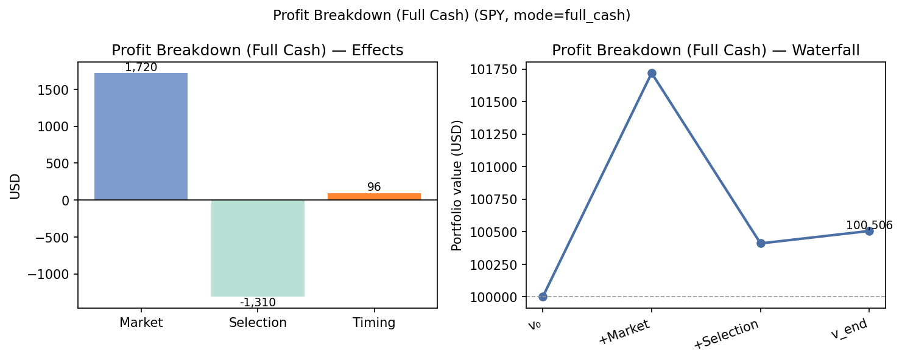
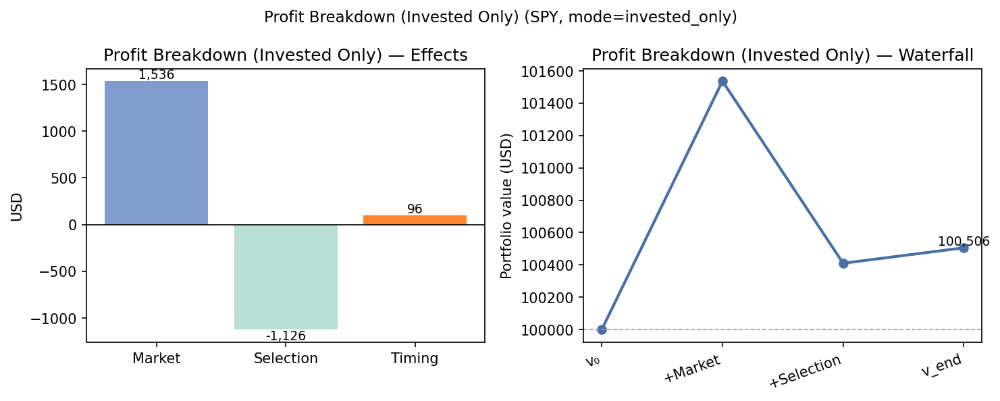
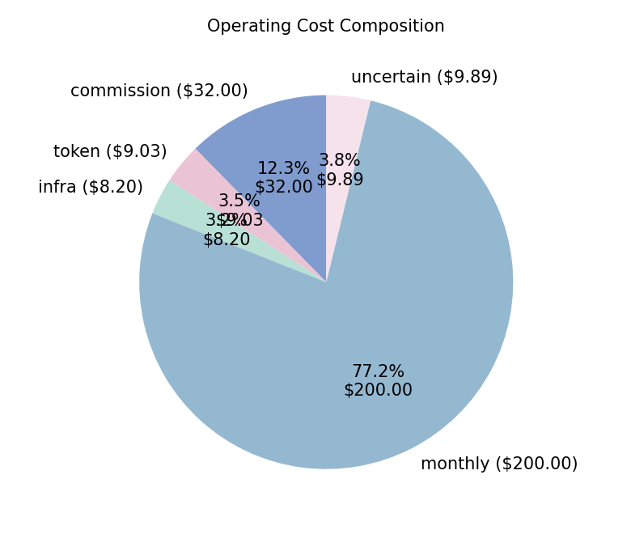
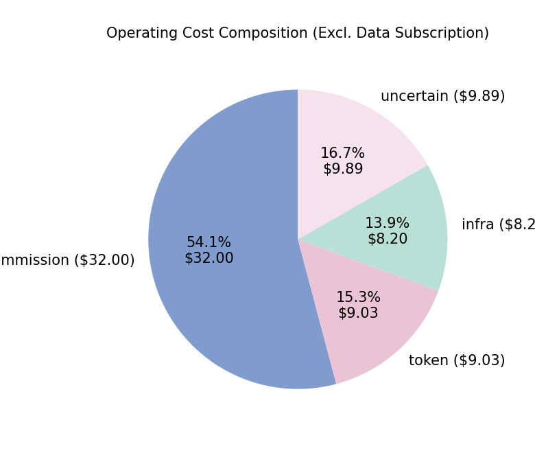
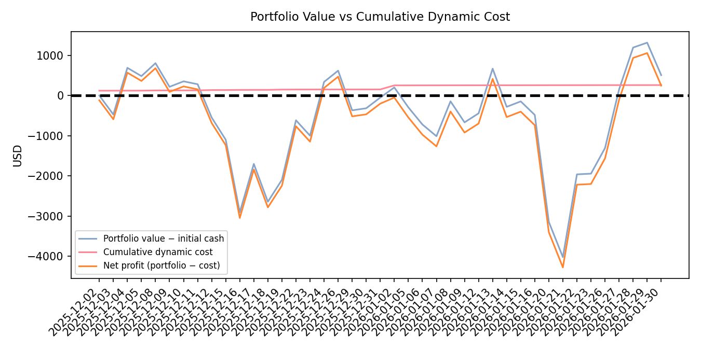
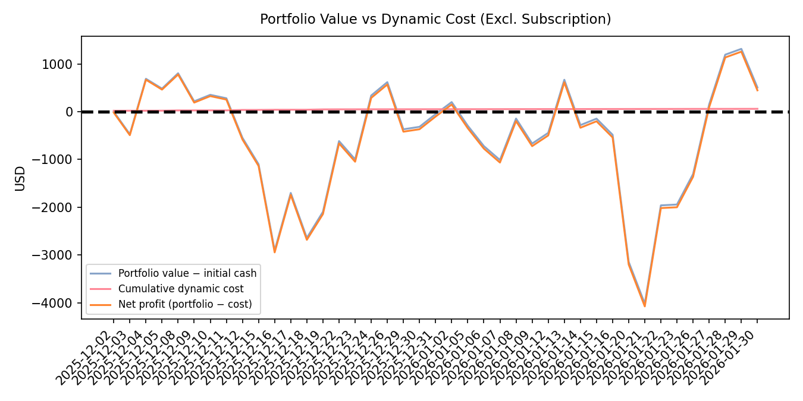

# Financial Report

## 1. Trading Configuration

Trading Period:
2025-12-01 - 2026-1-30

Trading Model / Strategy:
gpt-5.2-100000

Assets:
AAPL, AMZN, AVGO, GOOG, GOOGL, META, MSFT, NVDA, TSLA

## 2. Asset & Portfolio State

Initial Cash:
100000.00

Current Cash:
163.77

Positions:
- AAPL: 39
- AMZN: 43
- AVGO: 34
- GOOG: 31
- GOOGL: 46
- META: 17
- MSFT: 23
- NVDA: 75
- TSLA: 14

Total Position Value:
100341.99

Total Portfolio Value:
100505.76

## 3. Performance

Return / Profit:
505.76

### Figure 1. Profit Attribution — Full Cash Benchmark

### Figure 2. Profit Attribution — Invested Cash Only

## 3.1 Profit Breakdown (market / selection / timing)

Benchmark Symbol: SPY
Benchmark Available: True
Benchmark Return: 1.72%

v0 (Initial Cash):
100000.00

v_market (Benchmark Final Value):
101719.91

v_static (Initial Holdings Buy&Hold Final Value):
100410.11

v_end (Strategy Final Value):
100505.76

Market Effect:
1719.91

Asset Selection Effect:
-1309.80

Timing Effect:
95.65

Total Profit:
505.76

Initial Holdings (first build day, post-trade):
AAPL:35, AMZN:46, AVGO:25, GOOG:31, GOOGL:32, META:15, MSFT:24, NVDA:66, TSLA:13

## 3.2 Financial Statement (Profit & Loss Style)

Two attribution views: **full initial cash** tracks the whole portfolio against the benchmark; **invested-only** removes idle cash after the first build day when applying market moves.

### Table A — Full Cash / Market Benchmark

Benchmark: **SPY** | Mode: `full_cash` | Benchmark return: 1.72%

| Line item | Amount (USD) |
| --- | ---: |
| Initial capital (v₀) | 100,000.00 |
| Benchmark portfolio at end (v_market) | 101,719.91 |
| Buy & hold portfolio at end (v_static) | 100,410.11 |
| Strategy portfolio at end (v_end) | 100,505.76 |
| | |
| **Profit attribution** | |
| Market effect | 1,719.91 |
| Asset selection effect | -1,309.80 |
| Timing effect | 95.65 |
| **Total profit (gross)** | **505.76** |
| | |
| Invested cash (excl. idle cash after day 1) | 89,295.51 |
| Cash after first build day | 10,704.49 |

### Table B — Invested Cash Only (Proportional to Deployed Capital)

Benchmark: **SPY** | Mode: `invested_only` | Benchmark return: 1.72%

| Line item | Amount (USD) |
| --- | ---: |
| Initial capital (v₀) | 100,000.00 |
| Benchmark portfolio at end (v_market) | 101,535.80 |
| Buy & hold portfolio at end (v_static) | 100,410.11 |
| Strategy portfolio at end (v_end) | 100,505.76 |
| | |
| **Profit attribution** | |
| Market effect | 1,535.80 |
| Asset selection effect | -1,125.69 |
| Timing effect | 95.65 |
| **Total profit (gross)** | **505.76** |
| | |
| Invested cash (excl. idle cash after day 1) | 89,295.51 |
| Cash after first build day | 10,704.49 |

### Consolidated Net Outcome (two views)

| Line item | Amount (USD) |
| --- | ---: |
| **Portfolio level** | |
| Gross profit (v_end − v₀) | 505.76 |
| Static cost (data subscription) | -200.00 |
| Dynamic cost (commission + token + infra + uncertain) | -59.12 |
| Total operating cost | -259.12 |
| **Net economic outcome (gross − total cost)** | **246.64** |
| | |
| **Execution / timing layer** | |
| Timing effect (vs initial buy&hold) | 95.65 |
| Dynamic cost (same as above) | -59.12 |
| **Net timing outcome (timing − dynamic cost)** | **36.53** |

## 4. Cost Summary
Daily actions and line-item costs: `gpt-5.2-100000-daily-action.txt`.

| Cost bucket | Amount (USD) |
| --- | ---: |
| Static (data subscription) | 200.00 |
| Dynamic (commission + token + infra + uncertain) | 59.12 |
| **Total** | **259.12** |

<figure class="report-figure report-figure-compact">
  
  <figcaption>Figure 3. Operating Cost Composition</figcaption>
</figure>
<figure class="report-figure report-figure-compact">
  
  <figcaption>Figure 4. Operating Cost Composition (Excl. Data Subscription)</figcaption>
</figure>

## 5. Portfolio Timeline

### Figure 5. Portfolio Value vs Cumulative Dynamic Cost

### Figure 6. Portfolio Value vs Dynamic Cost (Excl. Subscription)

## 6. Execution Quality

Opportunity Cost (Decision Price - Execution Price)
460.98

Average Latency per Trade
23495.44 ms

Average Daily LLM Latency
67870.78 ms

Average Daily Input Tokens
91323.76

Average Daily Output Tokens
3072.05

## 7. Net Economic Outcome

Daily actions and detailed cost lines: see `gpt-5.2-100000-daily-action.txt`.

### 7.1 Portfolio level — gross profit vs total cost

Uses profit-breakdown **total profit** (v_end − v₀), i.e. market + selection + timing.

| Line item | Amount (USD) |
| --- | ---: |
| Gross profit (attribution total) | 505.76 |
| Return / profit (portfolio replay) | 505.76 |
| Static cost | -200.00 |
| Dynamic cost | -59.12 |
| Total cost | -259.12 |
| **Net outcome (gross − total cost)** | **246.64** |

### 7.2 Execution layer — timing effect vs dynamic cost

Isolates **timing** (actual strategy vs buy&hold) against costs that scale with trading/decisions.

| Line item | Amount (USD) |
| --- | ---: |
| Market effect (context) | 1,719.91 |
| Asset selection effect (context) | -1,309.80 |
| Timing effect | 95.65 |
| Dynamic cost | -59.12 |
| **Net timing outcome (timing − dynamic cost)** | **36.53** |

